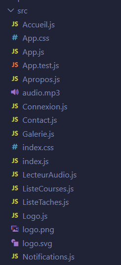

# 📘 TP React – Navigation, Composants et Exercices

## 🎯 Objectif du TP

Ce TP a pour but de maîtriser :

* La création de composants React
* La navigation avec React Router
* L’affichage conditionnel
* La manipulation des listes avec `map()`
* L’intégration de médias (image + audio)

---

# ⚙️ Étape 1 : Création du projet

## 📌 Commande

```bash
npx create-react-app tp-navigation
cd tp-navigation
npm start
```

---

# ⚙️ Étape 2 : Structure du projet

## 📌 Création des composants

* Accueil.js
* Apropos.js
* Connexion.js


👉 VS Code (structure du dossier src)

---

# ⚙️ Étape 3 : Navigation avec React Router

## 📌 Installation

```bash
npm install react-router-dom
```

## 📌 Configuration

* BrowserRouter dans index.js
* Routes dans App.js

## 📸 Capture 3


---

# ⚙️ Étape 4 : Composant Connexion

## 📌 Description

Afficher :

* "Connecté"
* "Déconnecté"

avec un bouton


👉 Avant clic → Déconnecté
👉 Après clic → Connecté

---

# ⚙️ Étape 5 : Liste des tâches

## 📌 Description

Afficher une liste avec `map()`

## 📸 Capture 5

👉 Liste :

* Apprendre React
* Créer une application
* Tester le code


---

# ⚙️ Étape 6 : Image et Audio

## 📌 Description

Afficher :

* une image (logo)
* un lecteur audio


👉 Image + bouton play audio visible

---

# ⚙️ Étape 7 : Résultat intermédiaire

👉 Application complète avec :

* navigation
* connexion
* liste
* image/audio

---

# ⚙️ Étape 8 : Exercices pratiques

## 🔹 Exercice 1 : Notifications

Afficher :
"Vous avez des notifications" si notifications > 0

---

## 🔹 Exercice 2 : ListeCourses

Afficher une liste avec `map()`

---

## 🔹 Exercice 3 : Galerie

Afficher 3 images

---

## 🔹 Exercice 4 : Contact

Créer une page `/contact`

---


👉 Doit contenir :

* Message de notification
* Liste des courses
* Galerie (3 images)
* Page Contact accessible

---

# 📁 Structure finale

```bash
src/
 ├── App.js
 ├── Accueil.js
 ├── Apropos.js
 ├── Contact.js
 ├── Connexion.js
 ├── ListeTaches.js
 ├── ListeCourses.js
 ├── Galerie.js
 ├── Notifications.js
 ├── audio.mp3
 ├── logo.png
```


---

# 🚀 Lancer le projet

```bash
npm install
npm start
```

---

# ✅ Résultat final

* ✔️ Navigation entre pages
* ✔️ Composants fonctionnels
* ✔️ Affichage conditionnel
* ✔️ Listes dynamiques
* ✔️ Image et audio intégrés
* ✔️ Exercices réalisés

---

# 💡 Conclusion

Ce TP permet de comprendre les bases essentielles de React :

* Gestion des composants
* Navigation (routing)
* Interaction utilisateur
* Manipulation des données

---

# 👨‍💻 Auteur

* Nom : (abderrahmane souaiki)
* Projet : TP React Navigation
